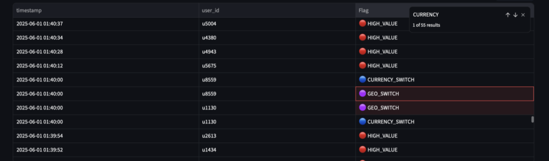
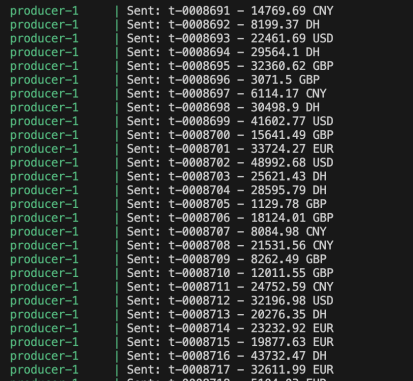

## Détection de Fraude en Streaming avec Kafka & Spark
---
# Structure du projet

```plaintext
flux_donnee/
├── .vscode/                  # Configurations VS Code
├── app/
│   └── spark_streaming.py    # Script Spark pour détecter les fraudes en temps réel
├── kafka_producer.py         # Script Python pour générer des transactions fictives
├── Dockerfile.producer       # Dockerfile du service Producer Kafka
├── docker-compose.yml        # Lancement des services (Kafka, Spark, etc.)
└── README.md                 # (Ce fichier)
```


---

## Objectif
Mettre en place une chaîne de traitement de données **en streaming** avec **Kafka** et **Spark Structured Streaming** pour détecter différentes formes de fraude financière à partir de transactions synthétiques générées en continu.

---

## Description des fichiers

### `kafka_producer.py`
- Génère des transactions simulées (`user_id`, montant, lieu, devise, etc.)
- Envoie les données vers le topic Kafka `transactions`
- **Paramètres :**
  - `rate_per_second` : nombre de transactions générées par seconde
  - `total_transactions` : nombre total de transactions à envoyer

### `spark_streaming.py`
Script exécuté dans un conteneur Spark, consommant les données du topic Kafka `transactions` et détectant les fraudes en temps réel.

**Règles de détection :**
1. **HIGH_VALUE** → Montant > 49 000 €
2. **HIGH_FREQUENCY** → ≥ 3 transactions en 5 minutes
3. **GEO_SWITCH** → Changement géographique rapide
4. **CURRENCY_SWITCH** → Utilisation de plusieurs devises en peu de temps
5. **CAROUSEL_FRAUD** → Petits montants chez plusieurs marchands différents

**Les alertes détectées sont :**
- Affichées dans la console
- Enregistrées en fichiers Parquet (`output/parquet_alerts`)
- Envoyées vers le topic Kafka `fraud-alerts`

---

### `Dockerfile.producer`
Image Docker pour exécuter le producteur Kafka en Python.

### `docker-compose.yml`
Orchestre les services suivants :
- **zookeeper** : coordination pour Kafka
- **kafka** : broker Kafka
- **producer** : génération des transactions fictives
- **spark** : traitement en streaming avec détection de fraude

---

## Lancement du projet
Pour lancer tous les services :
```bash
docker-compose up --build
````

---

## Dossiers générés automatiquement

```
output/
├── parquet_alerts/         # Fichiers Parquet des fraudes détectées
├── checkpoint_parquet/     # Checkpoints Spark pour l’écriture Parquet
└── checkpoint_kafka/       # Checkpoints Spark pour l’écriture vers Kafka
```

---

## Visualisation des résultats

### Console Kafka

Pour afficher les alertes détectées en temps réel :

```bash
docker exec -it flux_donnee-kafka-1 kafka-console-consumer \
  --bootstrap-server localhost:9092 \
  --topic fraud-alerts \
  --from-beginning
```

**Les alertes sont disponibles :**

* Dans les fichiers Parquet (`output/parquet_alerts`)
* Dans le topic Kafka `fraud-alerts`

---

## Dashboard Streamlit

Interface de visualisation **en temps réel** avec rafraîchissement toutes les 5 secondes.

Accès : [http://localhost:8501](http://localhost:8501)

**Fonctionnalités :**

* Compteur par type de fraude
* Description détaillée des fraudes
* Compteur global de fraudes détectées
* Tableau dynamique des dernières fraudes (`transaction_id`, `user_id`, type, flag)

---

### Interface à l’état initial

* Compteurs à zéro
* Tableau vide


### Rafraîchissement automatique

* Mise à jour toutes les 5 secondes
* Dernières fraudes affichées


Le tableau au bas de la page StreamLit permet de consulter le détail des dernières fraudes détectées : 



---

## Remarques

## High Value

Cette fraude correspond à toute transaction dont le montant dépasse 49 000 €.  
Nous avons fixé ce seuil afin de simuler un cas de fraude réaliste.  

**Pourquoi pas 45 000 € ?**  
Avec un seuil à 45 000 € (montant choisi initialement), la probabilité d'avoir une transaction supérieure à cette valeur aurait été trop élevée.

Le montant de chaque transaction suit une loi uniforme discrète entre 1 et 50 000, ce qui permet de calculer précisément la probabilité de détecter cette fraude.

Soit $X$ une variable aléatoire qui suit une loi uniforme discrète sur l'ensemble des entiers $\{1, 2, \ldots, 50\,000\}$.  

Chaque valeur est donc également probable :

$$P(X = k) = \frac{1}{50\,000}, \quad k = 1, 2, \ldots, 50\,000$$

On cherche la probabilité que $X$ soit supérieur ou égal à 49 000.

Nombre d'entiers entre 49 000 et 50 000 inclus :

$$50\,000 - 49\,000 + 1 = 1\,001$$

Donc : 

$$P(X \geq 49\,000) = \frac{\text{nombre de valeurs possibles pour } X \geq 49\,000}{\text{nombre total de valeurs possibles}}$$

$$P(X \geq 49\,000) = \frac{1\,001}{50\,000} \approx 0{,}02002 \quad \text{(soit environ 2,0 \%)}$$

Ce faible pourcentage justifie qu'il est pertinent de considérer toute transaction supérieure à 49 000 € comme potentiellement frauduleuse.

---

## Carousel Fraud

Cette fraude est définie comme :
> Plusieurs petits montants (< 20 €) dépensés chez plus de 3 marchands différents en moins de 3 minutes.

Ce type de fraude, bien que rare dans notre simulation, est représentatif de techniques réelles.  

Dans la pratique, les fraudeurs commencent souvent par effectuer de petites transactions discrètes afin de tester si la carte volée est encore active, sans que le véritable propriétaire ne s'en rende compte immédiatement.  

Si ces tests passent inaperçus, ils enchaînent ensuite avec un retrait important.

C'est précisément pour simuler ce schéma réel de fraude que nous avons intégré cette règle dans notre système de détection.  

### Rareté dans la simulation

Cependant, dans notre simulation, cette situation est totalement absente. Cela s'explique par deux facteurs :

1. **Spécificité du comportement** : Le schéma simulé est très spécifique (plus de 3 commerçants, montants < 20 €, en < 3 min), ce qui en fait une condition rare.

2. **Distribution aléatoire** : La génération aléatoire des transactions ne favorise pas ce type de schéma :
   - Les petits montants sont moins fréquents
   - Les identifiants de marchands sont dispersés

Pour pouvoir vérifier que cette fraude est bien détectée par notre système, nous avons généré de manière artificielle des transactions correspondant à ce cas.


## Annexes



